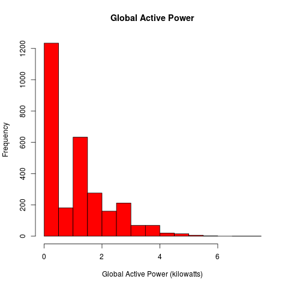
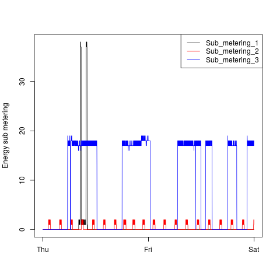
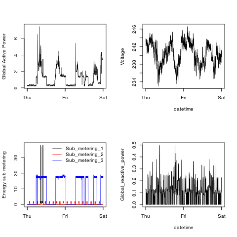

## Exploratory Data Analysis Project - Week 1

This is the week 1 project for Exploratory Data Analysis.

The code creates the four plots shown below:

### Plot 1





### Plot 2


### Plot 3




### Plot 4



## Usage

To produce plots, source the appropriate R script. E.g:

```
source('plot1.R')
```
